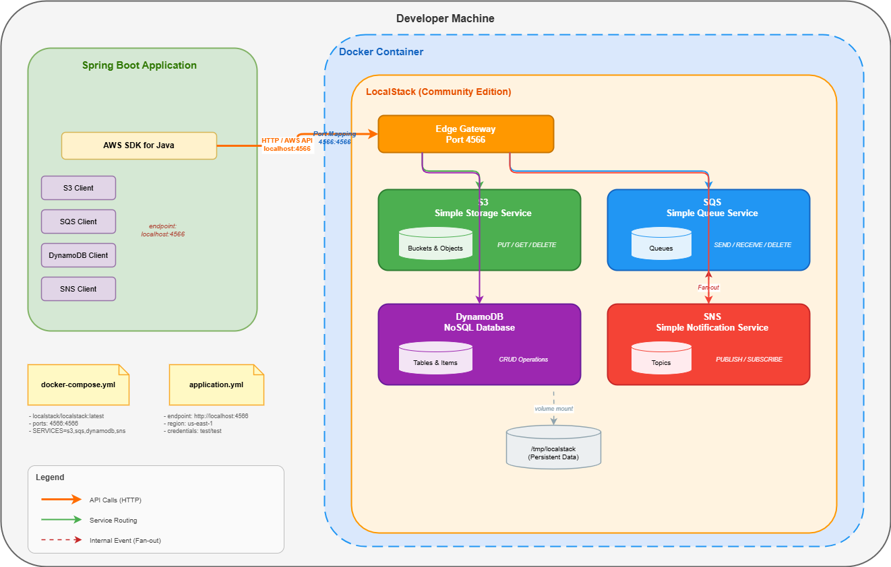

# LocalStack POC — AWS Services Locally with Spring Boot

## Overview

This proof of concept demonstrates how to run AWS services **locally** using [LocalStack](https://localstack.cloud/) inside Docker, while using the **same AWS SDK code** that runs in production. The application switches between LocalStack and real AWS purely through environment variables — **zero code changes required**.

## Architecture



## AWS Services Demonstrated

| Service   | Purpose              | Resource Created  | Use Case                          |
|-----------|----------------------|-------------------|-----------------------------------|
| **S3**    | Object/file storage  | `poc-bucket`      | Upload, download, and list files  |
| **SQS**   | Message queuing      | `poc-queue`       | Async messaging between services  |
| **DynamoDB** | NoSQL database    | `poc-table`       | Key-value data persistence        |
| **SNS**   | Pub/sub notifications| `poc-topic`       | Event fan-out to subscribers      |

## Tech Stack

- **Java 21** with **Spring Boot 3.4.2**
- **AWS SDK v2** (`software.amazon.awssdk`) for S3, SQS, DynamoDB, SNS
- **Docker** + **Docker Compose** for container orchestration
- **LocalStack 3.8** for local AWS emulation

## Project Structure

```
LocalStack-POC/
├── pom.xml                        # Maven build — Spring Boot + AWS SDK v2
├── Dockerfile                     # Multi-stage build (Maven build → JRE runtime)
├── docker-compose.yml             # Orchestrates LocalStack + Spring Boot app
├── init-aws.sh                    # Creates AWS resources when LocalStack starts
├── setup-check.sh                 # Verifies required tools are installed
├── diagram.drawio                 # Architecture diagram (editable — open with draw.io)
├── diagram.png                    # Architecture diagram (exported image)
├── .env                           # Environment variables (git-ignored)
├── .env.example                   # Template for .env (safe to commit)
├── .gitignore                     # Git ignore rules
├── .gitattributes                 # Ensures LF line endings for shell scripts
├── .dockerignore                  # Excludes unnecessary files from Docker build
│
└── src/main/
    ├── java/com/example/localstackpoc/
    │   ├── LocalStackPocApplication.java       # Spring Boot entry point
    │   ├── config/
    │   │   └── AwsConfig.java                  # AWS client beans (endpoint switching logic)
    │   ├── controller/
    │   │   ├── S3Controller.java               # REST endpoints for S3
    │   │   ├── SqsController.java              # REST endpoints for SQS
    │   │   ├── DynamoDbController.java         # REST endpoints for DynamoDB
    │   │   └── SnsController.java              # REST endpoints for SNS
    │   ├── service/
    │   │   ├── S3Service.java                  # S3 business logic
    │   │   ├── SqsService.java                 # SQS business logic
    │   │   ├── DynamoDbService.java            # DynamoDB business logic
    │   │   └── SnsService.java                 # SNS business logic
    │   └── model/
    │       ├── Item.java                       # DynamoDB item DTO
    │       ├── MessageRequest.java             # SQS message DTO
    │       └── NotificationRequest.java        # SNS notification DTO
    └── resources/
        └── application.yml                     # Spring config with env var placeholders
```

## How the Environment Switching Works

The core mechanism lives in `AwsConfig.java`:

```java
// When AWS_ENDPOINT_URL is set → all clients point to LocalStack
// When AWS_ENDPOINT_URL is empty → clients use default AWS endpoints
private boolean isEndpointOverridden() {
    return endpointUrl != null && !endpointUrl.isBlank();
}
```

| Environment Variable   | LocalStack Value              | Real AWS Value             |
|------------------------|-------------------------------|----------------------------|
| `AWS_ENDPOINT_URL`     | `http://localstack:4566`      | _(leave empty or remove)_  |
| `AWS_REGION`           | `us-east-1`                   | Your target region         |
| `AWS_ACCESS_KEY_ID`    | `test`                        | Real IAM access key        |
| `AWS_SECRET_ACCESS_KEY`| `test`                        | Real IAM secret key        |

No Java code changes. Just environment variables.

---

## Getting Started

### Prerequisites

- Docker and Docker Compose installed
- (Optional) AWS CLI for direct LocalStack inspection

### Verify Prerequisites

```bash
bash setup-check.sh
```

This checks for Docker, Docker Compose, Java, Maven, AWS CLI, and Postman — and creates `.env` from `.env.example` if missing.

### Start Everything

```bash
docker-compose up --build
```

This single command:
1. Starts LocalStack and waits for it to be healthy
2. Runs `init-aws.sh` which creates the S3 bucket, SQS queue, DynamoDB table, and SNS topic
3. Builds the Spring Boot app and starts it on port 8081

### Stop and Clean Up

```bash
docker-compose down -v
```

The `-v` flag removes volumes so LocalStack starts fresh next time.

---

## REST API Endpoints

### S3 — File Storage

| Method | Endpoint                       | Description         |
|--------|--------------------------------|---------------------|
| POST   | `/api/s3/upload`               | Upload a file       |
| GET    | `/api/s3/files`                | List all files      |
| GET    | `/api/s3/download/{filename}`  | Download a file     |

### SQS — Message Queue

| Method | Endpoint           | Description              |
|--------|--------------------|--------------------------|
| POST   | `/api/sqs/send`    | Send a message           |
| GET    | `/api/sqs/receive` | Receive messages (5s poll)|

### DynamoDB — NoSQL Database

| Method | Endpoint                   | Description         |
|--------|----------------------------|---------------------|
| POST   | `/api/dynamodb/items`      | Create/update item  |
| GET    | `/api/dynamodb/items/{id}` | Get item by ID      |
| GET    | `/api/dynamodb/items`      | List all items      |

### SNS — Notifications

| Method | Endpoint                    | Description                 |
|--------|-----------------------------|-----------------------------|
| POST   | `/api/sns/publish`          | Publish a notification      |
| POST   | `/api/sns/subscribe/email`  | Subscribe email to topic    |
| POST   | `/api/sns/subscribe/sqs`    | Subscribe SQS queue to topic|

---

## Testing with Postman

### S3 — Upload File
- **POST** `http://localhost:8081/api/s3/upload`
- Body → **form-data** → key: `file` (type: File) → select a file

### S3 — List Files
- **GET** `http://localhost:8081/api/s3/files`

### S3 — Download File
- **GET** `http://localhost:8081/api/s3/download/yourfile.txt`

### SQS — Send Message
- **POST** `http://localhost:8081/api/sqs/send`
- Body → raw → JSON:
```json
{
    "body": "Hello from SQS!"
}
```

### SQS — Receive Messages
- **GET** `http://localhost:8081/api/sqs/receive`

### DynamoDB — Put Item
- **POST** `http://localhost:8081/api/dynamodb/items`
- Body → raw → JSON:
```json
{
    "id": "1",
    "name": "Test Item",
    "description": "A test item for the POC"
}
```

### DynamoDB — Get Item
- **GET** `http://localhost:8081/api/dynamodb/items/1`

### DynamoDB — List All Items
- **GET** `http://localhost:8081/api/dynamodb/items`

### SNS — Publish
- **POST** `http://localhost:8081/api/sns/publish`
- Body → raw → JSON:
```json
{
    "subject": "Test Alert",
    "message": "Hello from SNS!"
}
```

### SNS — Subscribe SQS to Topic
- **POST** `http://localhost:8081/api/sns/subscribe/sqs`
- Body → raw → JSON:
```json
{
    "queueArn": "arn:aws:sqs:us-east-1:000000000000:poc-queue"
}
```

---

## AWS CLI Commands (Direct LocalStack Access)

These commands interact with LocalStack directly on port 4566, bypassing the Spring Boot app. Useful for debugging and verifying resource state.

> **Note:** All commands use `--endpoint-url=http://localhost:4566` to target LocalStack and `--profile localstack` for the correct region/credentials. Without the profile (or `--region us-east-1`), the CLI uses your default region and region-scoped services (DynamoDB, SQS, SNS) will return empty results.

### AWS CLI Profile Setup (One-Time)

Before running the commands below, create a `localstack` profile:

```bash
aws configure --profile localstack
# AWS Access Key ID: test
# AWS Secret Access Key: test
# Default region name: us-east-1
# Default output format: json
```

### LocalStack Health Check

```bash
curl http://localhost:4566/_localstack/health
```

### S3 Commands

```bash
# List all buckets
aws --endpoint-url=http://localhost:4566 --profile localstack s3 ls

# List objects in the POC bucket
aws --endpoint-url=http://localhost:4566 --profile localstack s3 ls s3://poc-bucket

# Upload a file directly via CLI
aws --endpoint-url=http://localhost:4566 --profile localstack s3 cp myfile.txt s3://poc-bucket/

# Download a file
aws --endpoint-url=http://localhost:4566 --profile localstack s3 cp s3://poc-bucket/myfile.txt ./downloaded.txt

# Remove a file
aws --endpoint-url=http://localhost:4566 --profile localstack s3 rm s3://poc-bucket/myfile.txt

# Get bucket details
aws --endpoint-url=http://localhost:4566 --profile localstack s3api get-bucket-location --bucket poc-bucket
```

### SQS Commands

```bash
# List all queues
aws --endpoint-url=http://localhost:4566 --profile localstack sqs list-queues

# Get queue URL
aws --endpoint-url=http://localhost:4566 --profile localstack sqs get-queue-url --queue-name poc-queue

# Send a message
aws --endpoint-url=http://localhost:4566 --profile localstack sqs send-message \
    --queue-url http://sqs.us-east-1.localhost.localstack.cloud:4566/000000000000/poc-queue \
    --message-body "Hello from AWS CLI"

# Receive messages
aws --endpoint-url=http://localhost:4566 --profile localstack sqs receive-message \
    --queue-url http://sqs.us-east-1.localhost.localstack.cloud:4566/000000000000/poc-queue \
    --max-number-of-messages 10

# Get queue attributes (message count, etc.)
aws --endpoint-url=http://localhost:4566 --profile localstack sqs get-queue-attributes \
    --queue-url http://sqs.us-east-1.localhost.localstack.cloud:4566/000000000000/poc-queue \
    --attribute-names All

# Purge all messages from the queue
aws --endpoint-url=http://localhost:4566 --profile localstack sqs purge-queue \
    --queue-url http://sqs.us-east-1.localhost.localstack.cloud:4566/000000000000/poc-queue
```

### DynamoDB Commands

```bash
# List all tables
aws --endpoint-url=http://localhost:4566 --profile localstack dynamodb list-tables

# Describe the table (schema, key, status)
aws --endpoint-url=http://localhost:4566 --profile localstack dynamodb describe-table --table-name poc-table

# Scan all items in the table
aws --endpoint-url=http://localhost:4566 --profile localstack dynamodb scan --table-name poc-table

# Get a specific item by key
aws --endpoint-url=http://localhost:4566 --profile localstack dynamodb get-item \
    --table-name poc-table \
    --key '{"id": {"S": "1"}}'

# Put an item directly
aws --endpoint-url=http://localhost:4566 --profile localstack dynamodb put-item \
    --table-name poc-table \
    --item '{"id": {"S": "99"}, "name": {"S": "CLI Item"}, "description": {"S": "Added via AWS CLI"}}'

# Delete an item
aws --endpoint-url=http://localhost:4566 --profile localstack dynamodb delete-item \
    --table-name poc-table \
    --key '{"id": {"S": "99"}}'

# Get item count
aws --endpoint-url=http://localhost:4566 --profile localstack dynamodb scan \
    --table-name poc-table \
    --select COUNT
```

### SNS Commands

```bash
# List all topics
aws --endpoint-url=http://localhost:4566 --profile localstack sns list-topics

# Get topic attributes
aws --endpoint-url=http://localhost:4566 --profile localstack sns get-topic-attributes \
    --topic-arn arn:aws:sns:us-east-1:000000000000:poc-topic

# Publish a message to the topic
aws --endpoint-url=http://localhost:4566 --profile localstack sns publish \
    --topic-arn arn:aws:sns:us-east-1:000000000000:poc-topic \
    --subject "CLI Alert" \
    --message "Hello from AWS CLI"

# List subscriptions for the topic
aws --endpoint-url=http://localhost:4566 --profile localstack sns list-subscriptions-by-topic \
    --topic-arn arn:aws:sns:us-east-1:000000000000:poc-topic

# Subscribe SQS queue to SNS topic
aws --endpoint-url=http://localhost:4566 --profile localstack sns subscribe \
    --topic-arn arn:aws:sns:us-east-1:000000000000:poc-topic \
    --protocol sqs \
    --notification-endpoint arn:aws:sqs:us-east-1:000000000000:poc-queue

# List all subscriptions
aws --endpoint-url=http://localhost:4566 --profile localstack sns list-subscriptions
```

---

## Switching to Real AWS

To point this application at real AWS without changing any code:

1. Remove `AWS_ENDPOINT_URL` (or set it to empty)
2. Set `AWS_ACCESS_KEY_ID` and `AWS_SECRET_ACCESS_KEY` to real IAM credentials
3. Set `AWS_REGION` to your target region (e.g., `ap-south-1`)
4. Set resource names (`S3_BUCKET_NAME`, `SQS_QUEUE_NAME`, etc.) to actual resource names
5. Ensure the AWS resources exist (create via Terraform, CloudFormation, or console)

The Java code remains identical.

---

## Key Design Decisions

| Decision | Rationale |
|----------|-----------|
| Environment-driven config | Single `AWS_ENDPOINT_URL` check switches the entire stack |
| S3 path-style access | LocalStack requires it; enabled only when endpoint is overridden |
| Low-level DynamoDB client | Demonstrates raw SDK usage for the POC |
| `@PostConstruct` + lazy init | Handles timing between LocalStack resource creation and app startup |
| Constructor injection | Spring best practice; avoids field injection |
| Multi-stage Docker build | Smaller runtime image (~200MB vs ~500MB) |
| Docker health checks | Ensures LocalStack is ready before the app starts |

---

## Troubleshooting

| Issue | Solution |
|-------|----------|
| Port 8081 already in use | Change the host port in `docker-compose.yml` (e.g., `8082:8080`) |
| `init-aws.sh` fails with `bad interpreter` | Ensure the file has Unix line endings (LF, not CRLF) |
| App cannot connect to LocalStack | Check that `AWS_ENDPOINT_URL` uses `localstack` hostname (not `localhost`) |
| SQS receive returns empty | Messages are deleted after receipt; send a new one first |
| Docker build fails on dependency download | Re-run `docker-compose up --build` (transient network issue) |
| CLI returns empty tables/queues/topics | Region mismatch — use `--profile localstack` or `--region us-east-1` (S3 appears global but DynamoDB, SQS, SNS are region-scoped) |
